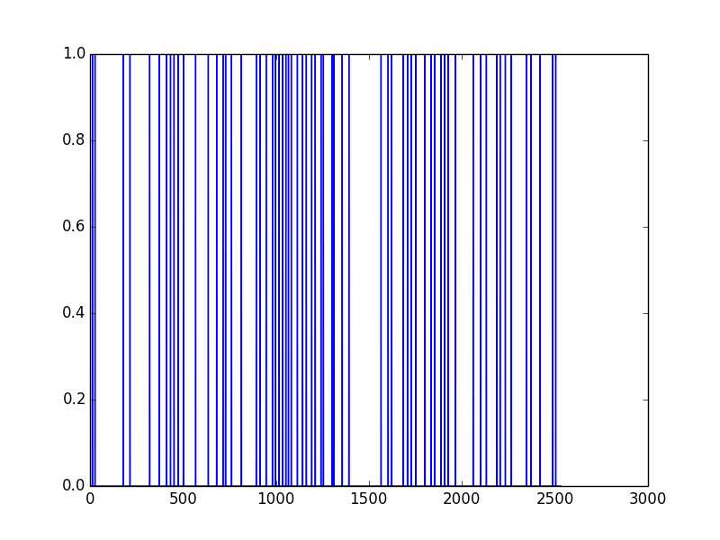
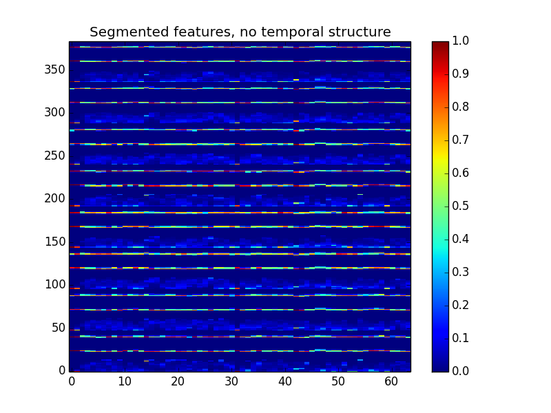
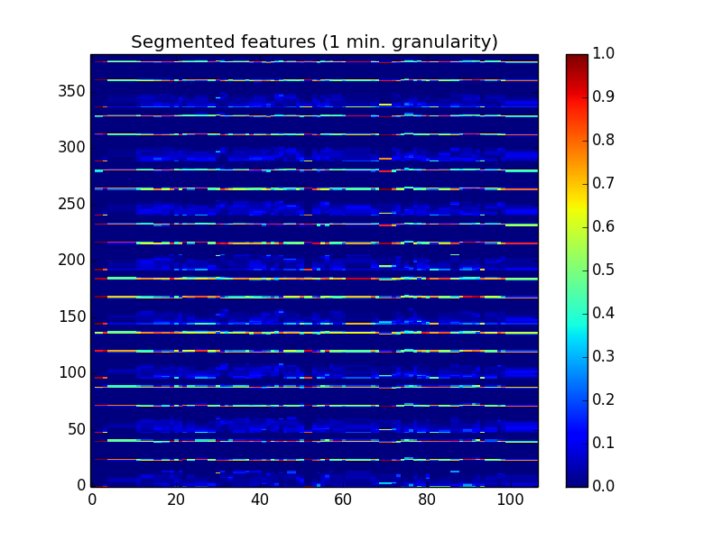
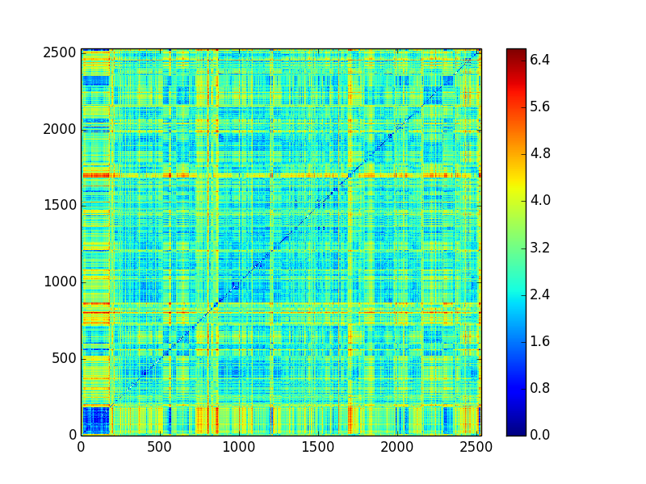

**********************************************************
Example Five: Segmentation of Film based on Color Features
**********************************************************

Abstract
========

This example shows a two-pass segmentation algorithm. The first pass uses hierarchical clustering; the second pass filters the first set of segments so that they are not too close together. The user could influence the number and granularity of segments by changing input control parameters.

First Pass: Hierarchical Segmenter
==================================

First some preliminaries, then the function ``actionSegmenterHC`` performs clustering on color features. It then converts those clusters to segments, using the ACTION/Bregman Segment class. It returns the segments (including feature data) plus the segmenter's assignments of frames to segments.

.. code-block:: python

	from action.suite import *
	import numpy as np
	import os

	ACTION_DIR = os.path.expanduser('~/Movies/action/')

	def actionSegmenterHC(title, abFlag=False):
		ds_segs = []
		cfl = ColorFeaturesLAB(title, action_dir=ACTION_DIR)

		length = cfl.determine_movie_length() # in seconds
		length_in_frames = length * 4

		full_segment = Segment(0, duration=length)
		Dmb = cfl.middle_band_color_features_for_segment(full_segment)
		if abFlag is True: Dmb = cfl.convertLabToL(Dmb)

		decomposed = ad.calculate_pca_and_fit(Dmb, locut=0.0001)

		nc = length_in_frames / 10
		hc_assigns = ad.cluster_hierarchically(decomposed, nc, None)

		segs = ad.convert_clustered_frames_to_segs(hc_assigns, nc)
		segs.sort()
		# get rid of the first seg
		#      del segs[0]

		for seg in segs:
		  ds_segs += [Segment(
			   seg[0]*0.25,
			   duration=(seg[1]*0.25),
			   features=np.mean(Dmb[seg[0]:(seg[0]+seg[1]),:],axis=0))]
		return ds_segs, hc_assigns, hc_assigns.max()

	dssegs, hca, hcm = actionSegmenterHC('A_Serious_Man')

Filtering the segments
----------------------

Next, do some thresholding based on the differences between data frames. The ``THRESH`` variable controls the minimum difference threshold to consider a new segment.

.. code-block:: python

	THRESH = 2.5
	MIN_FRAMES = 10

First, view the dissimilarity matrix between the segment data (one set of data per frame from segmenter):

	data = np.array([seg.features for seg in dssegs])
	imagesc(euc2(data, data))

..
	.. image:: /images/action_ex5_sim_matrix.png

Get the Euclidean distances among/of the differences between frames.

.. code-block:: python

	num_frames = data.shape[0]
	sumdiffs = np.sqrt(np.sum(np.power(np.diff(data, axis=0), 2.0), axis=1))

Only look at segments whose diff is above a threshold

.. code-block:: python

	cleaner = []
	curr = -1*MIN_FRAMES

	for val in np.argwhere(sumdiffs>THRESH):
		if (val[0] - curr) > MIN_FRAMES:
			cleaner += [val[0]]
		curr = val[0]

	divs = []
	for i in range(num_frames):
		try:
			cleaner.index(i)
			divs += [1]
		except ValueError:
			divs += [0]

``divs`` holds a pattern of 1's and 0's that show your segmentation frames. You can plot this. These are the segments where the first-order difference (*between segment frames*) is above a threshold.

.. code-block:: python

	plt.plot(divs)

Viewing the segmentation data
=============================

Now rebuild your segments--cleaner holds all your segment onsets (as *segment* indices)--and view their data.

.. code-block:: python

	from itertools import *
	def pairwise(iterable):
		"s -> (s0,s1), (s1,s2), (s2, s3), ..."
		a, b = tee(iterable)
		next(b, None)
		return izip(a, b)

	final_segs = []
	i = 0
	for a, b in pairwise(cleaner):
		new_start = dssegs[a].time_span.start_time
		new_dur = dssegs[b].time_span.start_time - dssegs[a].time_span.start_time
		new_med_feature = np.median(data[a:b], axis=0)
		print (new_start, new_dur,  new_med_feature.shape)
		final_segs += [Segment(label=i, start_time=new_start, duration=new_dur, features = new_med_feature)]
		i += 1

	resegmented_data = np.array([seg.features for seg in final_segs])
	imagesc(resegmented_data.T, title_string='Segmented features, no temporal structure')

That view is of the data per-segment, averaged over that segment. However, let's make a view that preserves the temporal structure

A Better View
-------------

.. code-block:: python

	counter = 0
	final_segs_stack = final_segs[:]
	final_resegmented = np.zeros(384, dtype=np.float32)
	cfl = ColorFeaturesLAB('A_Serious_Man', action_dir=ACTION_DIR)

	for i in range(0, int(cfl.determine_movie_length()), 60):
		# always concat
		try:
			print np.atleast_2d(final_resegmented).shape
			print np.atleast_2d(final_segs_stack[counter].features).shape
			final_resegmented = np.append(np.atleast_2d(final_resegmented), np.atleast_2d(final_segs_stack[counter].features), axis=0)
			if final_segs_stack[counter].time_span.start_time < i:
				##
				counter += 1
		except IndexError:
			counter -= 1
			final_resegmented = np.append(np.atleast_2d(final_resegmented), np.atleast_2d(final_segs_stack[counter].features), axis=0)
		print '-- ', i
		print '>> ', counter	

	imagesc(final_resegmented.T, title_string='Segmented features (1 min. granularity)')

Finally, let's see the dissimilarity matrix for our segmented data:
 
.. code-block:: python

	imagesc(euc2(final_resegmented, final_resegmented), title_string='Dissimilarity map based on segments')

We have presented one way to automatically segment and then view the subsequent data for a feature film using ACTION. In the `next <example_six_director_prediction.html>`_ section, we will use the some of this data to predict directors.